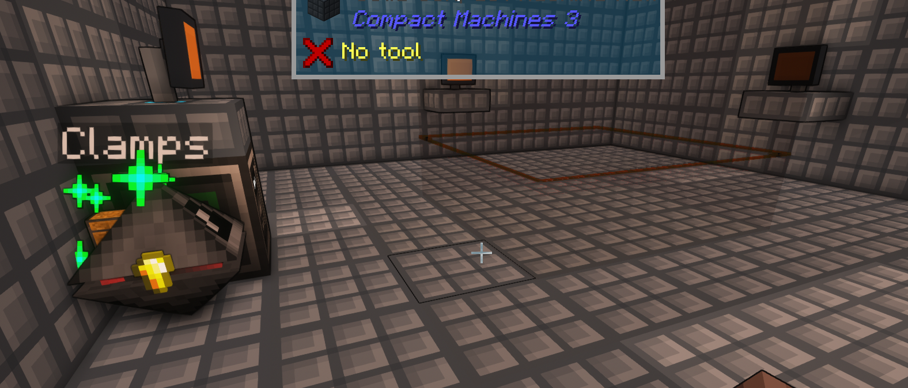

# Compact Claustrophobia - Open Computers
I created these programs while playing through the [`Compact Claustrophobia`](https://www.curseforge.com/minecraft/modpacks/compact-claustrophobia) [`minecraft`](https://www.minecraft.net) modpack on [`FTB`](https://www.feed-the-beast.com/).  
I hope you find them useful; they helped me a lot. **:)**

### P.S.
**Make sure you read the comments and place blocks in the correct slots!**  
**Sometimes the bot cannot pick up the items and they expire on the floor. Check in often!**  
**Compare the receipt screen, and the minify recipe, with the number of result blocks to determine how much you're missing; maybe you can spawn those in? ;D**

## Setup
I copied `robot_hub.lua` (named `autorun` on disk) and the programs in `./minify` to a `floppy disk` for my robot.  

### Layout
This is the layout my **3x3x3** programs expect:  

### It helps to set up a link to the floppy disk mount.  
You need to know its ID to set this up.
1. `# cd /home`
2. `# edit .shrc`
3. Add the following line: `ln /mnt/1fa robot/`
    1. Hover over the `floppy disk` in your inventory and look at the `ID`.
    2. Replace the `1fa` above with the first 3 characters of your disk's `ID`.
4. `ctrl+s` to save.
5. `ctrl+w` to exit.
6. (optional) Disable autorun on your main, non-robot, computer.
   1. `# edit /etc/filesystem.cfg`
   2. Add this line: `autorun=false`
   3. `save` & `exit`
7. `reboot`  

You are now able to safely insert floppies containing an `autorun`, and you can (more) easily access files on your robot floppy.

## Floppy Disk Setup
**Open Computers** is annoying, or I am a noob. This is how I get code where it needs to be.  
You can `shift+click` on the floppy in your inventory after opening the robot UI to put it in the right slot.

### Modify Program on Floppy
1. Insert floppy into disk reader.
   - You can hold the floppy and `shift+right_click` it into the `Disk Drive`.
2. `# rm robot/<path_to_program>` **(if program exists on floppy)**
    - e.g. `rm robot/autorun`
3. `# edit robot/<path_to_program>`
    - If you ran `step 2`, press the `up arrow` key, `home` key, `delete` key x2, then type `edit` and press `enter`. **:)**
4. Copy the code into your clipboard on your real computer. **(IRL)**
5. Press down your `scroll wheel` on your mouse to paste. **(IN GAME)**
6. Wait for the **(long)** animation.
7. Confirm all of the code you copied got pasted in.
   1. **CAREFULLY** inspect the last few lines at the bottom. It may have not pasted everything you copied.  
   2. Find the start of the first line it missed and copy from there to the end of the code to your real clipboard again. **(perfect whitespace/line-up should not matter)**  
   3. **CAREFULLY** click on the first pixel of the first empty line at the bottom and press your `mouse wheel` again to paste. Repeat until all the code makes it in correctly.
      - Targetting the position of the white `caret` pixel seems to work usually.
8. `save` & `exit`
9.  (optional) `# eject` if you are using my eject util.

Press `ctrl+c` to escape if you need to.